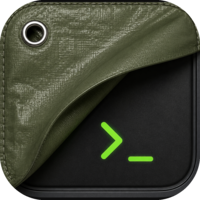

<p align="center">
  
</p>

<h1 align="center">Tarp</h1>

<p align="center">
  A plain, modern terminal — the terminal left after the extra layers are pulled away.
</p>

<p align="center">
  <em>Not AI-native. Not cloud-first. Not an account system. Just a terminal.</em>
</p>

---

> **Tarp is an independent, community fork of [Warp](https://www.warp.dev).** It is
> **not affiliated with, endorsed by, or sponsored by** Warp or Denver Technologies, Inc.
> Tarp removes the AI, cloud, account, and code-editor layers from Warp's
> open-source client and keeps the terminal.

## About

Tarp is a fork of Warp's open-source terminal client with the non-terminal
concerns removed: no built-in AI agent, no cloud sync, no accounts/sign-in, no
built-in code editor. What remains is Warp's fast GPU-rendered terminal — blocks,
rich completions, command corrections, workflows, themes, SSH, and shell
integration — as a plain local tool you run and own.

The name is literal: a tarp is simple protection and useful material — humble,
practical, and stripped back. That's the intent here.

## Status

Early but usable — **`v0.1.0` is the first released build** (macOS, Apple Silicon;
see [Download](#download)). The client builds, bundles, and runs as a terminal with
the AI/cloud/account/editor surfaces disabled. Releases are unsigned for now (a
Gatekeeper step is needed on first launch). See [`TARP-PLAN.md`](TARP-PLAN.md) for
the roadmap, [`docs/`](docs/README.md) for the audit and design notes, and
[`docs/PROGRESS.md`](docs/PROGRESS.md) for the work log.

## Download

Grab the latest `Tarp-macos-arm64.dmg` from the
[Releases](https://github.com/ramsrib/tarp/releases) page (macOS, Apple Silicon),
open it, and drag **Tarp** to Applications.

Builds are currently **unsigned**, so macOS Gatekeeper warns on first launch. One
time only, either:

- **right-click the app → Open** and confirm the dialog, or
- clear the quarantine flag: `xattr -dr com.apple.quarantine /Applications/Tarp.app`

After that it opens normally. (Signing/notarization is a planned follow-up — see
[`RELEASING.md`](RELEASING.md). Intel/universal, Linux, and Windows builds are not
published yet; build from source for those.)

## Building from source

Tarp builds with the standard Rust toolchain plus a couple of platform
prerequisites (notably the macOS Metal Toolchain). Full instructions, including
the gotchas, are in [`BUILD.md`](BUILD.md).

```sh
# macOS quick start (see BUILD.md for prerequisites)
cargo build --bin tarp --features gui      # build the binary
./script/run                               # build + bundle + launch Tarp.app
./script/presubmit                         # fmt + clippy + tests
```

The default build is the open-source channel and requires no account or network
service.

## Licensing

Tarp inherits Warp's licensing:

- The UI framework crates (`warpui`, `warpui_core`) are under the
  [MIT license](LICENSE-MIT).
- The rest of the repository is under the [AGPL v3](LICENSE-AGPL).

Tarp is a derivative work and remains under these licenses. Upstream copyright
notices (Denver Technologies, Inc.) are retained; see [`NOTICE`](NOTICE).

## Contributing

Tarp is open source and welcomes contributions — see
[`CONTRIBUTING.md`](CONTRIBUTING.md). Please be respectful per the
[Code of Conduct](CODE_OF_CONDUCT.md). Report security issues privately as
described in [`SECURITY.md`](SECURITY.md).

## Acknowledgements

Tarp exists because [Warp](https://github.com/warpdotdev/warp) open-sourced its
terminal client. Thank you to the Warp team and to the open-source projects the
terminal builds on — among them Alacritty, Tokio, NuShell, the Fig completion
specs, FontKit, core-foundation-rs, and many more (full third-party attribution
is generated for releases).
